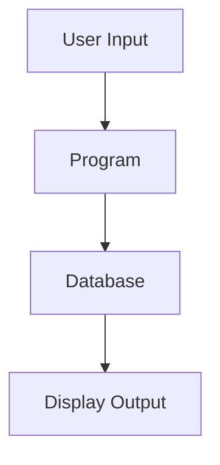

# RPGLE to Java Modernization Project - Setup Guide

## Project Overview

This document contains instructions for setting up a complete AI-assisted modernization project to convert 50 RPGLE programs to Java. You (Claude Code) will create the entire project structure, templates, documentation, and helper scripts.

## Project Goals

- Convert 50 RPGLE programs to modern Java applications
- Use AI agents (specialized Claude Code sessions) for different conversion tasks
- Maintain consistency and quality across all conversions
- Build reusable patterns and knowledge base during the process

## Target Architecture

- **Backend**: Spring Boot 3.x with Java 17+
- **Database**: JPA/Hibernate for data access (compatible with DB2)
- **UI**: React with TypeScript (converting from 5250 green screens)
- **Testing**: JUnit 5, Mockito, Spring Boot Test
- **Build**: Maven

## Instructions for Claude Code

Please create the following complete project structure with all necessary files, templates, and documentation.

---

## Phase 1: Create Directory Structure

Create the following directory structure:

```
/modernization-project/
├── agents/
│   ├── 01-analysis-agent/
│   ├── 02-database-agent/
│   ├── 03-conversion-agent/
│   ├── 04-ui-agent/
│   ├── 05-testing-agent/
│   └── 06-review-agent/
├── common-patterns/
│   └── utilities/
├── source-rpgle/
│   ├── programs/
│   ├── dds/
│   │   ├── display-files/
│   │   ├── physical-files/
│   │   └── logical-files/
│   └── copybooks/
├── work-in-progress/
├── final-output/
│   └── src/
│       ├── main/
│       │   ├── java/
│       │   │   └── com/company/modernization/
│       │   │       ├── entities/
│       │   │       ├── repositories/
│       │   │       ├── services/
│       │   │       ├── controllers/
│       │   │       ├── dto/
│       │   │       ├── exceptions/
│       │   │       └── utilities/
│       │   └── resources/
│       │       ├── templates/
│       │       └── static/
│       │           ├── css/
│       │           └── js/
│       └── test/
│           └── java/
│               └── com/company/modernization/
├── documentation/
│   └── progress-tracking/
└── scripts/
```

---

## Phase 2: Create Agent Configuration Files

For each agent folder, create the following files:

### /agents/01-analysis-agent/

**README.md**
```markdown
# Analysis Agent

## Purpose
Analyze RPGLE programs to extract business logic, data flows, dependencies, and create comprehensive documentation.

## Inputs Required
1. RPGLE source file from `/source-rpgle/programs/{PROGRAM}.rpgle`
2. Related DDS files from `/source-rpgle/dds/`
3. Any copybooks from `/source-rpgle/copybooks/`
4. This agent's checklist: `checklist.md`

## Outputs to Produce
Create in `/work-in-progress/{PROGRAM}/01-analysis/`:
1. `{PROGRAM}-analysis.md` - Complete analysis document including:
   - Business purpose and logic flow
   - All dependencies (programs, files, copybooks)
   - Data flow diagram (Mermaid format)
   - Complexity assessment
   - Special considerations
   - Conversion notes

## Process
1. Read the RPGLE source code completely
2. Identify the program's business purpose
3. Map all file operations (database, display, printer)
4. Document all external program calls
5. Identify all indicators and their meanings
6. Extract business rules and validation logic
7. Assess complexity (LOW/MEDIUM/HIGH)
8. Note any special considerations (date handling, packed decimals, etc.)

## Output Format
Use the template in `analysis-template.md`

## Quality Checklist
Before marking analysis complete, verify:
- [ ] Business purpose clearly stated
- [ ] All input/output parameters documented
- [ ] All files (DB, display, printer) identified
- [ ] All external calls mapped
- [ ] Data flow documented
- [ ] Complexity assessed
- [ ] Special considerations noted
- [ ] Dependencies list is complete
```

**analysis-template.md**
```markdown
# {PROGRAM} - Analysis Report

**Analysis Date**: {DATE}
**Analyst**: AI Analysis Agent
**Complexity**: [LOW / MEDIUM / HIGH]

---

## 1. Program Purpose

[Clear description of what this program does from a business perspective]

## 2. Program Type

- [ ] Interactive (with display file)
- [ ] Batch Processing
- [ ] Report Generation
- [ ] Utility/Service Program
- [ ] API/Service

## 3. Input Parameters

| Parameter | Type | Description |
|-----------|------|-------------|
| | | |

## 4. Output Parameters

| Parameter | Type | Description |
|-----------|------|-------------|
| | | |

## 5. Files Used

### Physical Files (Database)
| File Name | Access Type | Key Fields | Purpose |
|-----------|-------------|------------|---------|
| | | | |

### Display Files
| File Name | Purpose | Records |
|-----------|---------|---------|
| | | |

### Printer Files
| File Name | Purpose |
|-----------|---------|
| | |

## 6. External Program Calls

| Program Called | Purpose | When Called |
|----------------|---------|-------------|
| | | |

## 7. Business Logic Flow

[Describe the main business logic flow in steps]

1. 
2. 
3. 

## 8. Data Flow



## 9. Key Indicators Used

| Indicator | Purpose | Set When |
|-----------|---------|----------|
| *INLR | Last Record | Program termination |
| | | |

## 10. Special Considerations

### Date/Time Handling
- 

### Numeric Precision
- 

### Error Handling
- 

### Performance Notes
- 

## 11. Dependencies

### Called By
- 

### Calls To
- 

### Shared Resources
- 

## 12. Conversion Complexity Assessment

**Overall Complexity**: [LOW / MEDIUM / HIGH]

**Complexity Factors**:
- Business Logic Complexity: [1-5]
- UI Complexity: [1-5]
- Database Interactions: [1-5]
- External Dependencies: [1-5]

**Risk Areas**:
- 

## 13. Conversion Notes

[Any specific notes for the conversion agent about tricky parts or important considerations]

## 14. Test Scenarios to Cover

1. 
2. 
3. 
```

**checklist.md**
```markdown
# Analysis Agent Checklist

## Source Code Review
- [ ] Identified all H-specs (program configuration)
- [ ] Identified all F-specs (file declarations)
- [ ] Identified all D-specs (data definitions)
- [ ] Identified all C-specs (calculations/logic)
- [ ] Reviewed all subroutines
- [ ] Checked for /COPY inclusions

## Business Logic
- [ ] Main program purpose documented
- [ ] All business rules extracted
- [ ] Validation logic documented
- [ ] Error handling patterns identified

## Data Analysis
- [ ] All input sources identified
- [ ] All output destinations identified
- [ ] Data transformations documented
- [ ] Field mappings created

## Dependencies
- [ ] Database files cataloged
- [ ] Display files cataloged
- [ ] External program calls noted
- [ ] Shared copybooks identified

## Special Cases
- [ ] Date/time handling reviewed
- [ ] Packed decimal usage documented
- [ ] Array operations noted
- [ ] Complex calculations flagged
```

---

### /agents/02-database-agent/

**README.md**
```markdown
# Database Agent

## Purpose
Create JPA entities, repositories, and database access layer based on RPGLE file definitions.

## Inputs Required
1. DDS files from `/source-rpgle/dds/physical-files/`
2. DDS files from `/source-rpgle/dds/logical-files/`
3. Analysis document from `/work-in-progress/{PROGRAM}/01-analysis/`
4. Type mappings guide: `type-mappings.md`
5. Naming conventions: `naming-conventions.md`

## Outputs to Produce
Create in `/work-in-progress/{PROGRAM}/02-database/`:
1. JPA Entity classes (e.g., `Customer.java`)
2. Repository interfaces (e.g., `CustomerRepository.java`)
3. Custom query methods if needed
4. `database-notes.md` - Documentation of conversion decisions

## Process
1. Read all DDS definitions referenced in the analysis
2. Convert field types using type-mappings.md
3. Identify primary keys and relationships
4. Create JPA entities with proper annotations
5. Create repository interfaces with custom methods
6. Document any schema changes or decisions

## Output Format
Use templates in this folder

## Quality Checklist
- [ ] All fields from DDS mapped to entity
- [ ] Correct JPA annotations used
- [ ] Primary keys properly defined
- [ ] Column names match DB2 names
- [ ] Relationships properly mapped
- [ ] Repository methods match RPGLE operations
```

**type-mappings.md**
```markdown
# RPGLE to Java Type Mappings

## Numeric Types

| RPGLE Type | DDS | Java Type | Notes |
|------------|-----|-----------|-------|
| Packed Decimal | P | BigDecimal | Financial data, exact precision |
| Zoned Decimal | S | BigDecimal | Financial data |
| Binary | B | Integer or Long | Depending on size |
| Integer | I | Integer | 4-byte integer |
| Unsigned | U | Long | Java doesn't have unsigned |

### Precision Guidelines
- For packed decimal (n,d): Use `@Column(precision=n, scale=d)`
- For money: Always BigDecimal with appropriate scale
- For quantities: BigDecimal or Integer depending on decimals

## Character Types

| RPGLE Type | DDS | Java Type | Notes |
|------------|-----|-----------|-------|
| Character | A | String | Fixed or variable length |
| Varchar | VARLEN | String | Variable length |
| Graphic | G | String | Unicode characters |

## Date/Time Types

| RPGLE Type | DDS | Java Type | Notes |
|------------|-----|-----------|-------|
| Date | L | LocalDate | Use @Temporal for legacy |
| Time | T | LocalTime | |
| Timestamp | Z | LocalDateTime | |
| Legacy (YYMMDD) | 6,0 | String or LocalDate | Convert in service layer |
| Legacy (MMDDYY) | 6,0 | String or LocalDate | Convert in service layer |
| Legacy (YYYYMMDD) | 8,0 | String or LocalDate | Convert in service layer |

## Indicator Type

| RPGLE Type | Java Type | Notes |
|------------|-----------|-------|
| Indicator (*INxx) | Boolean | true/false |
| Indicator Array | boolean[] | For *IN array |

## Special Cases

### Null Handling
- RPG blank = Java null for Strings
- RPG zero = Consider if should be null for numbers
- Use `@Column(nullable = false)` only when field truly required

### Key Fields
- Primary key: Use `@Id`
- Composite key: Create `@Embeddable` class
- Generated key: Use `@GeneratedValue` if appropriate

### DB2 Specific
- For DB2 schemas: Use `@Table(name = "TABLENAME", schema = "SCHEMANAME")`
- For DB2 column names: Use `@Column(name = "COLNAME")`
```

**naming-conventions.md**
```markdown
# Database Naming Conventions

## Entity Class Names
- Use singular, PascalCase
- Example: `Customer` (not `Customers`, not `CUSTMAST`)
- Should represent business concept, not file name

## Field Names
- Use camelCase in Java
- Example: `customerNumber` (not `CUSNUM`)
- Be descriptive and clear

## Repository Names
- Pattern: `{Entity}Repository`
- Example: `CustomerRepository`

## Table/Column Annotations
- Keep original DB2 names in annotations
- Example: `@Table(name = "CUSTMAST")`
- Example: `@Column(name = "CUSNUM")`

## Package Structure
- Entities: `com.company.modernization.entities`
- Repositories: `com.company.modernization.repositories`

## Examples

### Physical File: CUSTMAST
```java
@Entity
@Table(name = "CUSTMAST")
public class Customer {
    
    @Id
    @Column(name = "CUSNUM", precision = 7, scale = 0)
    private BigDecimal customerNumber;
    
    @Column(name = "CUSNAM", length = 30)
    private String customerName;
    
    @Column(name = "CUSADR", length = 50)
    private String address;
    
    @Column(name = "CUSCTY", length = 20)
    private String city;
    
    @Column(name = "CUSSTS", length = 2)
    private String state;
    
    @Column(name = "CUSZIP", length = 10)
    private String zipCode;
    
    @Column(name = "CUSBAL", precision = 11, scale = 2)
    private BigDecimal balance;
    
    // Getters, setters, constructors
}
```
```

**entity-template.java**
```java
package com.company.modernization.entities;

import jakarta.persistence.*;
import java.math.BigDecimal;
import java.time.LocalDate;
import java.time.LocalDateTime;

/**
 * Entity representing {BUSINESS_CONCEPT}
 * Mapped to DB2 table: {TABLE_NAME}
 * Original RPGLE file: {FILE_NAME}
 */
@Entity
@Table(name = "{TABLE_NAME}")
public class {EntityName} {
    
    @Id
    @Column(name = "{KEY_FIELD}", precision = {P}, scale = {S})
    private BigDecimal {keyField};
    
    @Column(name = "{FIELD_NAME}", length = {LENGTH})
    private String {fieldName};
    
    @Column(name = "{FIELD_NAME}", precision = {P}, scale = {S})
    private BigDecimal {fieldName};
    
    @Column(name = "{DATE_FIELD}")
    private LocalDate {dateField};
    
    // Constructors
    public {EntityName}() {
    }
    
    public {EntityName}(BigDecimal {keyField}) {
        this.{keyField} = {keyField};
    }
    
    // Getters and Setters
    public BigDecimal get{KeyField}() {
        return {keyField};
    }
    
    public void set{KeyField}(BigDecimal {keyField}) {
        this.{keyField} = {keyField};
    }
    
    // ... other getters and setters
    
    // equals, hashCode, toString
    @Override
    public boolean equals(Object o) {
        if (this == o) return true;
        if (!(o instanceof {EntityName})) return false;
        {EntityName} that = ({EntityName}) o;
        return {keyField}.equals(that.{keyField});
    }
    
    @Override
    public int hashCode() {
        return {keyField}.hashCode();
    }
    
    @Override
    public String toString() {
        return "{EntityName}{" +
                "{keyField}=" + {keyField} +
                ", {fieldName}='" + {fieldName} + '\'' +
                '}';
    }
}
```

**repository-template.java**
```java
package com.company.modernization.repositories;

import com.company.modernization.entities.{EntityName};
import org.springframework.data.jpa.repository.JpaRepository;
import org.springframework.data.jpa.repository.Query;
import org.springframework.data.repository.query.Param;
import org.springframework.stereotype.Repository;

import java.math.BigDecimal;
import java.util.List;
import java.util.Optional;

/**
 * Repository for {EntityName} entity
 * Supports operations from RPGLE program: {PROGRAM_NAME}
 */
@Repository
public interface {EntityName}Repository extends JpaRepository<{EntityName}, BigDecimal> {
    
    // CHAIN operation equivalent (keyed read)
    Optional<{EntityName}> findBy{KeyField}(BigDecimal {keyField});
    
    // SETLL + READ equivalent (range read)
    List<{EntityName}> findBy{Field}GreaterThanEqualOrderBy{Field}(BigDecimal value);
    
    // Custom query if needed
    @Query("SELECT e FROM {EntityName} e WHERE e.{field} = :value")
    List<{EntityName}> findByCustomCriteria(@Param("value") String value);
    
    // Exists check (for validation)
    boolean existsBy{KeyField}(BigDecimal {keyField});
}
```

---

### /agents/03-conversion-agent/

**README.md**
```markdown
# Conversion Agent

## Purpose
Convert RPGLE programs to Java services following established patterns and best practices.

## Inputs Required
1. RPGLE source file from `/source-rpgle/programs/{PROGRAM}.rpgle`
2. Analysis document from `/work-in-progress/{PROGRAM}/01-analysis/`
3. Database entities from `/work-in-progress/{PROGRAM}/02-database/`
4. Display file specifications from `/source-rpgle/dds/display-files/`
5. All common patterns from `/common-patterns/`
6. Templates from this agent folder

## Outputs to Produce
Create in `/work-in-progress/{PROGRAM}/03-conversion/`:
1. Service class (e.g., `CustomerInquiryService.java`)
2. Controller class (e.g., `CustomerInquiryController.java`)
3. DTO classes (e.g., `CustomerInquiryDTO.java`)
4. Exception classes if needed
5. `conversion-notes.md` - Explain all decisions

## Process
1. Review analysis document thoroughly
2. Study the RPGLE logic flow
3. Map RPG operations to Java/Spring patterns (use `/common-patterns/rpg-operations-mapping.md`)
4. Implement business logic in service layer
5. Create REST API in controller layer
6. Define DTOs for data transfer
7. Add proper error handling
8. Add logging at key points
9. Document any deviations or special handling
10. **Document any issues encountered** - If you face significant challenges, unclear requirements, or make important decisions, document them clearly in `conversion-notes.md` for the project manager to review

## Output Format
Follow Spring Boot best practices and use provided templates

## Quality Checklist
- [ ] All RPGLE business logic converted
- [ ] Service layer properly implements logic
- [ ] Controller exposes appropriate REST endpoints
- [ ] DTOs properly structure data
- [ ] Error handling comprehensive
- [ ] Logging added appropriately
- [ ] Code follows Spring conventions
- [ ] Dependencies properly injected
- [ ] Conversion notes document complete
```

**conversion-patterns.md**
```markdown
# RPGLE to Java Conversion Patterns

## Program Structure Mapping

### RPGLE Program Components → Java Spring Components

| RPGLE Component | Java Spring Equivalent |
|-----------------|------------------------|
| Main C-specs | @Service class methods |
| Subroutines | Private methods in @Service |
| PLIST parameters | Method parameters |
| Global variables | Instance variables (minimize) |
| Display file I/O | REST API + DTO |
| File operations | Repository calls |

## Operation Code Conversions

### File Operations

#### CHAIN (Keyed Read)
```rpgle
CHAIN key CUSTMAST;
IF %FOUND(CUSTMAST);
  // Process record
ENDIF;
```
↓
```java
Optional<Customer> customer = customerRepository.findById(key);
if (customer.isPresent()) {
    // Process record
    Customer cust = customer.get();
}
```

#### READ (Sequential Read)
```rpgle
READ CUSTMAST;
DOW NOT %EOF(CUSTMAST);
  // Process record
  READ CUSTMAST;
ENDDO;
```
↓
```java
List<Customer> customers = customerRepository.findAll();
for (Customer customer : customers) {
    // Process record
}
```

#### SETLL + READ (Positioned Read)
```rpgle
SETLL key CUSTMAST;
READ CUSTMAST;
DOW NOT %EOF(CUSTMAST) AND condition;
  // Process record
  READ CUSTMAST;
ENDDO;
```
↓
```java
List<Customer> customers = customerRepository
    .findByCustomerNumberGreaterThanEqualOrderByCustomerNumber(key);
for (Customer customer : customers) {
    if (!condition) break;
    // Process record
}
```

#### WRITE (Insert)
```rpgle
WRITE CUSTREC;
```
↓
```java
customerRepository.save(customer);
```

#### UPDATE
```rpgle
UPDATE CUSTREC;
```
↓
```java
// Fetch, modify, save
Customer customer = customerRepository.findById(id)
    .orElseThrow(() -> new CustomerNotFoundException(id));
customer.setName(newName);
customerRepository.save(customer);
```

#### DELETE
```rpgle
DELETE CUSTREC;
```
↓
```java
customerRepository.deleteById(id);
```

### Control Flow

#### IF/ELSE
```rpgle
IF condition;
  // statements
ELSE;
  // statements
ENDIF;
```
↓
```java
if (condition) {
    // statements
} else {
    // statements
}
```

#### DOW (Do While)
```rpgle
DOW condition;
  // statements
ENDDO;
```
↓
```java
while (condition) {
    // statements
}
```

#### FOR
```rpgle
FOR i = 1 TO 10;
  // statements
ENDFOR;
```
↓
```java
for (int i = 1; i <= 10; i++) {
    // statements
}
```

#### SELECT/WHEN
```rpgle
SELECT;
  WHEN condition1;
    // statements
  WHEN condition2;
    // statements
  OTHER;
    // statements
ENDSL;
```
↓
```java
if (condition1) {
    // statements
} else if (condition2) {
    // statements
} else {
    // statements
}
// Or use switch if appropriate
```

### Display File Operations

#### EXFMT (Execute Format)
```rpgle
EXFMT SCREEN1;
IF *IN03;  // F3 pressed
  // Exit logic
ENDIF;
```
↓
```java
// In Controller - expose REST endpoint
@PostMapping("/customer-inquiry")
public ResponseEntity<CustomerInquiryResponse> inquire(
    @RequestBody CustomerInquiryRequest request) {
    
    if (request.isF3Pressed()) {
        // Exit logic
        return ResponseEntity.ok(new CustomerInquiryResponse(true));
    }
    
    CustomerInquiryResponse response = service.processInquiry(request);
    return ResponseEntity.ok(response);
}
```

### Indicator Handling

```rpgle
IF *IN03;  // F3 = Exit
IF *IN12;  // F12 = Cancel
*IN50 = *ON;  // Error indicator
```
↓
```java
// In DTO or Request object
private boolean f3Pressed;
private boolean f12Pressed;

// In Service - handle as business logic
if (request.isF3Pressed()) {
    // Handle exit
}

// Error indicators become exceptions or response flags
throw new ValidationException("Error condition");
// Or
response.setErrorFlag(true);
response.setErrorMessage("Error condition");
```

### Subroutine Calls

```rpgle
EXSR ValidateCustomer;

BEGSR ValidateCustomer;
  // Validation logic
ENDSR;
```
↓
```java
private void validateCustomer(Customer customer) {
    // Validation logic
    if (!isValid(customer)) {
        throw new ValidationException("Invalid customer");
    }
}
```

### Error Handling

```rpgle
MONITOR;
  // Code that might error
ON-ERROR;
  // Error handling
ENDMON;
```
↓
```java
try {
    // Code that might error
} catch (Exception e) {
    // Error handling
    log.error("Error occurred", e);
    throw new ServiceException("Operation failed", e);
}
```

## Data Type Conversions

### Numeric Operations

```rpgle
Result = Num1 + Num2;
Result = %DEC(Value:11:2);
```
↓
```java
BigDecimal result = num1.add(num2);
BigDecimal result = new BigDecimal(value).setScale(2, RoundingMode.HALF_UP);
```

### String Operations

```rpgle
String = %TRIM(Field);
String = %SUBST(Field:1:10);
Len = %LEN(Field);
```
↓
```java
String string = field.trim();
String string = field.substring(0, 10);
int len = field.length();
```

### Date Operations

```rpgle
CurrentDate = %DATE();
DateString = %CHAR(DateField);
```
↓
```java
LocalDate currentDate = LocalDate.now();
String dateString = dateField.toString();
```

## Common Utility Methods to Create

### Date Utilities
```java
public class DateUtils {
    public static LocalDate parseRpgDate(String rpgDate) {
        // Handle YYMMDD, MMDDYY, YYYYMMDD formats
    }
    
    public static String formatToRpg(LocalDate date) {
        // Convert to RPG format
    }
}
```

### Numeric Utilities
```java
public class NumericUtils {
    public static BigDecimal fromPackedDecimal(String packed, int scale) {
        // Convert packed decimal representation
    }
}
```
```

**service-template.java**
```java
package com.company.modernization.services;

import com.company.modernization.dto.*;
import com.company.modernization.entities.*;
import com.company.modernization.repositories.*;
import com.company.modernization.exceptions.*;
import org.slf4j.Logger;
import org.slf4j.LoggerFactory;
import org.springframework.beans.factory.annotation.Autowired;
import org.springframework.stereotype.Service;
import org.springframework.transaction.annotation.Transactional;

import java.math.BigDecimal;
import java.util.List;
import java.util.Optional;

/**
 * Service implementing business logic from RPGLE program: {PROGRAM_NAME}
 * Original purpose: {PROGRAM_PURPOSE}
 */
@Service
public class {ProgramName}Service {
    
    private static final Logger log = LoggerFactory.getLogger({ProgramName}Service.class);
    
    @Autowired
    private {Entity}Repository {entity}Repository;
    
    /**
     * Main business operation
     * Equivalent to RPGLE main logic
     */
    @Transactional
    public {Response}DTO processRequest({Request}DTO request) {
        log.info("Processing request for {}: {}", "{entity}", request.get{Key}());
        
        try {
            // Input validation
            validateRequest(request);
            
            // Main business logic (converted from RPGLE C-specs)
            {Response}DTO response = executeBusinessLogic(request);
            
            log.info("Request processed successfully");
            return response;
            
        } catch (Exception e) {
            log.error("Error processing request", e);
            throw new ServiceException("Failed to process request", e);
        }
    }
    
    /**
     * Validates input request
     * Equivalent to RPGLE validation subroutine
     */
    private void validateRequest({Request}DTO request) {
        if (request.get{Key}() == null) {
            throw new ValidationException("{Key} is required");
        }
        // Additional validation
    }
    
    /**
     * Core business logic
     * Converted from RPGLE main C-specs
     */
    private {Response}DTO executeBusinessLogic({Request}DTO request) {
        // Example: CHAIN operation
        Optional<{Entity}> entity = {entity}Repository.findById(request.get{Key}());
        
        if (!entity.isPresent()) {
            throw new NotFoundException("{Entity} not found: " + request.get{Key}());
        }
        
        // Process entity
        {Entity} record = entity.get();
        
        // Build response
        {Response}DTO response = new {Response}DTO();
        response.set{Field}(record.get{Field}());
        
        return response;
    }
    
    /**
     * Additional helper method
     * Equivalent to RPGLE subroutine: {SUBROUTINE_NAME}
     */
    private void helperMethod() {
        // Implementation
    }
}
```

**controller-template.java**
```java
package com.company.modernization.controllers;

import com.company.modernization.dto.*;
import com.company.modernization.services.*;
import com.company.modernization.exceptions.*;
import org.slf4j.Logger;
import org.slf4j.LoggerFactory;
import org.springframework.beans.factory.annotation.Autowired;
import org.springframework.http.HttpStatus;
import org.springframework.http.ResponseEntity;
import org.springframework.web.bind.annotation.*;

/**
 * REST API for {PROGRAM_NAME} functionality
 * Replaces RPGLE display file: {DISPLAY_FILE}
 */
@RestController
@RequestMapping("/api/{resource}")
@CrossOrigin(origins = "*")
public class {ProgramName}Controller {
    
    private static final Logger log = LoggerFactory.getLogger({ProgramName}Controller.class);
    
    @Autowired
    private {ProgramName}Service service;
    
    /**
     * Main endpoint - equivalent to EXFMT display
     * POST used to submit data (like pressing Enter in RPG screen)
     */
    @PostMapping("/process")
    public ResponseEntity<{Response}DTO> process(@RequestBody {Request}DTO request) {
        log.info("API request received: {}", request);
        
        try {
            {Response}DTO response = service.processRequest(request);
            return ResponseEntity.ok(response);
            
        } catch (ValidationException e) {
            log.warn("Validation error: {}", e.getMessage());
            return ResponseEntity.badRequest().body(createErrorResponse(e.getMessage()));
            
        } catch (NotFoundException e) {
            log.warn("Not found: {}", e.getMessage());
            return ResponseEntity.status(HttpStatus.NOT_FOUND)
                .body(createErrorResponse(e.getMessage()));
            
        } catch (Exception e) {
            log.error("Unexpected error", e);
            return ResponseEntity.status(HttpStatus.INTERNAL_SERVER_ERROR)
                .body(createErrorResponse("Internal server error"));
        }
    }
    
    /**
     * GET endpoint for initial screen load
     * Equivalent to displaying empty screen in RPG
     */
    @GetMapping("/init")
    public ResponseEntity<{Response}DTO> initialize() {
        {Response}DTO response = new {Response}DTO();
        // Set default values
        return ResponseEntity.ok(response);
    }
    
    private {Response}DTO createErrorResponse(String message) {
        {Response}DTO response = new {Response}DTO();
        response.setErrorMessage(message);
        response.setSuccess(false);
        return response;
    }
}
```

**dto-template.java**
```java
package com.company.modernization.dto;

import com.fasterxml.jackson.annotation.JsonProperty;
import java.math.BigDecimal;
import java.time.LocalDate;

/**
 * Data Transfer Object for {PROGRAM_NAME}
 * Represents data from RPGLE display file: {DISPLAY_FILE}
 */
public class {ProgramName}DTO {
    
    // Input fields (from display file input fields)
    @JsonProperty("customerNumber")
    private BigDecimal customerNumber;
    
    // Output fields (from display file output fields)
    @JsonProperty("customerName")
    private String customerName;
    
    // Control fields
    @JsonProperty("f3Pressed")
    private boolean f3Pressed;  // Exit key
    
    @JsonProperty("f12Pressed")
    private boolean f12Pressed;  // Cancel key
    
    // Response metadata
    @JsonProperty("success")
    private boolean success = true;
    
    @JsonProperty("errorMessage")
    private String errorMessage;
    
    // Constructors
    public {ProgramName}DTO() {
    }
    
    // Getters and Setters
    public BigDecimal getCustomerNumber() {
        return customerNumber;
    }
    
    public void setCustomerNumber(BigDecimal customerNumber) {
        this.customerNumber = customerNumber;
    }
    
    public String getCustomerName() {
        return customerName;
    }
    
    public void setCustomerName(String customerName) {
        this.customerName = customerName;
    }
    
    public boolean isF3Pressed() {
        return f3Pressed;
    }
    
    public void setF3Pressed(boolean f3Pressed) {
        this.f3Pressed = f3Pressed;
    }
    
    public boolean isF12Pressed() {
        return f12Pressed;
    }
    
    public void setF12Pressed(boolean f12Pressed) {
        this.f12Pressed = f12Pressed;
    }
    
    public boolean isSuccess() {
        return success;
    }
    
    public void setSuccess(boolean success) {
        this.success = success;
    }
    
    public String getErrorMessage() {
        return errorMessage;
    }
    
    public void setErrorMessage(String errorMessage) {
        this.errorMessage = errorMessage;
    }
    
    @Override
    public String toString() {
        return "{ProgramName}DTO{" +
                "customerNumber=" + customerNumber +
                ", customerName='" + customerName + '\'' +
                ", success=" + success +
                '}';
    }
}
```

**conversion-notes-template.md**
```markdown
# Conversion Notes for {PROGRAM}

**Conversion Date**: {DATE}
**Converter**: AI Conversion Agent

---

## Conversion Decisions

### Decision 1: {Description}
**RPGLE Pattern**: 
**Java Implementation**: 
**Rationale**: 

### Decision 2: {Description}
**RPGLE Pattern**: 
**Java Implementation**: 
**Rationale**: 

---

## Deviations from Standard Patterns

### Deviation 1: {Description}
**Why**: 
**Impact**: 
**Alternatives Considered**: 

---

## Issues Encountered

### Issue 1: {Description}
**Problem**: 
**Attempted Solutions**: 
**Final Solution**: 
**Status**: [Resolved / Needs Review / Blocked]
**Recommendation**: [Should this be escalated to issues-log.md?]

### Example Issue Format
**Problem**: RPGLE uses 15,5 packed decimal but standard BigDecimal conversion loses precision
**Attempted Solutions**: 
- Tried default BigDecimal constructor - precision was wrong
- Tried setScale(5) - worked correctly
**Final Solution**: Always use `new BigDecimal(value).setScale(5, RoundingMode.HALF_UP)`
**Status**: Resolved
**Recommendation**: Yes - this pattern should be added to `/common-patterns/numeric-handling.md`

---

## Special Considerations

### Performance
- 

### Security
- 

### Future Maintenance
- 

---

## Testing Recommendations

1. Test with maximum precision values
2. Test with zero values
3. Test with boundary conditions

---

## Questions for Review

1. Is the BigDecimal precision handling correct?
2. Should we add caching for frequently accessed data?

```

---

### /agents/04-ui-agent/

**README.md**
```markdown
# UI Agent

## Purpose
Convert RPGLE 5250 display files to modern React web interfaces while preserving business workflow.

## Inputs Required
1. Display file DDS from `/source-rpgle/dds/display-files/`
2. Analysis document from `/work-in-progress/{PROGRAM}/01-analysis/`
3. DTOs from `/work-in-progress/{PROGRAM}/03-conversion/`
4. DDS to React mapping guide: `dds-to-react-mapping.md`
5. Style guide: `style-guide.md`

## Outputs to Produce
Create in `/work-in-progress/{PROGRAM}/04-ui/`:
1. React component (e.g., `CustomerInquiryScreen.tsx`)
2. Type definitions (e.g., `types.ts`)
3. CSS/styled components
4. `ui-notes.md` - Document UI/UX decisions

## Process
1. Review display file DDS
2. Map fields to React components
3. Preserve business workflow (screen flow)
4. Enhance UX while maintaining functionality
5. Add responsive design
6. Implement accessibility features
7. Document any UX improvements

## Output Format
Use TypeScript with React functional components and hooks

## Quality Checklist
- [ ] All display file fields represented
- [ ] Function keys mapped appropriately
- [ ] Field validations implemented
- [ ] Error messages displayed properly
- [ ] Responsive design implemented
- [ ] Accessible (WCAG compliant)
- [ ] Follows style guide
```

**dds-to-react-mapping.md**
```markdown
# DDS Display File to React Mapping

## Field Type Mappings

| DDS Field Type | React Component | Notes |
|----------------|-----------------|-------|
| Input field | `<input type="text">` | Standard text input |
| Output field | `<span>` or `<div>` | Read-only display |
| Both (I/O) | `<input>` with conditional readonly | Can toggle |
| Hidden field | Hidden state variable | Don't render |

## DDS Keywords to React Props

### EDTCDE (Edit Code)
| DDS EDTCDE | React Formatting |
|------------|------------------|
| Y (Date) | Format using date-fns or similar |
| 1-4,A-D (Numeric) | Format with commas, decimals |
| Z (Zero suppress) | Display empty if zero |

### EDTWRD (Edit Word)
- Custom formatting based on pattern
- Use input masking libraries (e.g., react-input-mask)

### DSPATR (Display Attributes)
| DDS DSPATR | React/CSS Equivalent |
|------------|---------------------|
| HI (High intensity) | `font-weight: bold` |
| RI (Reverse image) | Inverse colors |
| UL (Underline) | `text-decoration: underline` |
| BL (Blink) | CSS animation (use sparingly!) |
| PC (Position cursor) | `autoFocus` prop |

### COLOR
| DDS COLOR | CSS Color |
|-----------|-----------|
| BLU | `color: blue` |
| GRN | `color: green` |
| RED | `color: red` |
| WHT | `color: white` or black (depends on theme) |

## Function Keys

### Standard Mappings
| RPG Function Key | React Implementation |
|------------------|---------------------|
| F3 (Exit) | Cancel/Close button |
| F5 (Refresh) | Refresh button or auto-refresh |
| F6 (Add) | Create/Add button |
| F12 (Cancel) | Cancel/Back button |
| Enter | Submit button or form submission |
| PageUp/PageDown | Pagination controls |

### Implementation Pattern
```typescript
const handleKeyPress = (event: KeyboardEvent) => {
    if (event.key === 'F3' || event.key === 'Escape') {
        handleExit();
    } else if (event.key === 'F12') {
        handleCancel();
    } else if (event.key === 'Enter') {
        handleSubmit();
    }
};

useEffect(() => {
    window.addEventListener('keydown', handleKeyPress);
    return () => window.removeEventListener('keydown', handleKeyPress);
}, []);
```

## Screen Flow Patterns

### Single Screen (Simple Inquiry)
```
User Input → Validation → API Call → Display Results
```

### Multi-Screen Workflow
Use React Router or state management:
```typescript
enum Screen {
    SELECTION,
    DETAIL,
    CONFIRMATION
}

const [currentScreen, setCurrentScreen] = useState<Screen>(Screen.SELECTION);
```

## Layout Considerations

### Convert Grid Layout
5250 is 24 rows × 80 columns
- Use CSS Grid or Flexbox
- Make responsive for modern screens
- Group related fields visually

### Example Conversion
```
DDS (5250):
Row 5, Col 10: "Customer Number:"
Row 5, Col 30: Input field (7 chars)

React:
<div className="form-row">
    <label>Customer Number:</label>
    <input type="text" maxLength={7} />
</div>
```

## Modern UX Enhancements

While preserving functionality:
1. **Add visual feedback**: Loading spinners, success messages
2. **Improve validation**: Inline validation, helpful error messages
3. **Responsive design**: Works on mobile, tablet, desktop
4. **Accessibility**: Proper labels, ARIA attributes, keyboard navigation
5. **Auto-complete**: For frequently used fields
6. **Smart defaults**: Remember user preferences
```

**screen-template.tsx**
```typescript
import React, { useState, useEffect } from 'react';
import axios from 'axios';
import './styles.css';

/**
 * {ProgramName} Screen
 * Converted from RPGLE display file: {DISPLAY_FILE}
 * Original program: {PROGRAM_NAME}
 */

interface {ProgramName}Request {
    customerNumber: string;
    f3Pressed?: boolean;
    f12Pressed?: boolean;
}

interface {ProgramName}Response {
    customerNumber: string;
    customerName: string;
    address: string;
    city: string;
    state: string;
    zipCode: string;
    balance: number;
    success: boolean;
    errorMessage?: string;
}

export const {ProgramName}Screen: React.FC = () => {
    // State for form fields
    const [customerNumber, setCustomerNumber] = useState<string>('');
    const [customerData, setCustomerData] = useState<{ProgramName}Response | null>(null);
    
    // State for UI control
    const [loading, setLoading] = useState<boolean>(false);
    const [error, setError] = useState<string>('');
    
    // Handle form submission (Enter key in RPG)
    const handleSubmit = async (e?: React.FormEvent) => {
        if (e) e.preventDefault();
        
        setLoading(true);
        setError('');
        
        try {
            const request: {ProgramName}Request = {
                customerNumber: customerNumber,
            };
            
            const response = await axios.post<{ProgramName}Response>(
                '/api/{resource}/process',
                request
            );
            
            if (response.data.success) {
                setCustomerData(response.data);
            } else {
                setError(response.data.errorMessage || 'Unknown error');
            }
            
        } catch (err: any) {
            setError(err.response?.data?.errorMessage || 'Failed to process request');
        } finally {
            setLoading(false);
        }
    };
    
    // Handle F3 (Exit)
    const handleExit = () => {
        // Navigate back or close
        window.history.back();
    };
    
    // Handle F12 (Cancel)
    const handleCancel = () => {
        setCustomerNumber('');
        setCustomerData(null);
        setError('');
    };
    
    // Keyboard shortcuts
    useEffect(() => {
        const handleKeyPress = (event: KeyboardEvent) => {
            if (event.key === 'F3' || event.key === 'Escape') {
                event.preventDefault();
                handleExit();
            } else if (event.key === 'F12') {
                event.preventDefault();
                handleCancel();
            }
        };
        
        window.addEventListener('keydown', handleKeyPress);
        return () => window.removeEventListener('keydown', handleKeyPress);
    }, []);
    
    return (
        <div className="screen-container">
            <div className="screen-header">
                <h1>{Program Title}</h1>
            </div>
            
            <form onSubmit={handleSubmit} className="screen-form">
                {/* Input Section */}
                <div className="form-section">
                    <div className="form-row">
                        <label htmlFor="customerNumber">Customer Number:</label>
                        <input
                            id="customerNumber"
                            type="text"
                            value={customerNumber}
                            onChange={(e) => setCustomerNumber(e.target.value)}
                            maxLength={7}
                            autoFocus
                            disabled={loading}
                        />
                    </div>
                </div>
                
                {/* Display Section (if data loaded) */}
                {customerData && (
                    <div className="form-section">
                        <div className="form-row">
                            <label>Name:</label>
                            <span className="output-field">{customerData.customerName}</span>
                        </div>
                        <div className="form-row">
                            <label>Address:</label>
                            <span className="output-field">{customerData.address}</span>
                        </div>
                        <div className="form-row">
                            <label>City:</label>
                            <span className="output-field">{customerData.city}</span>
                        </div>
                        <div className="form-row">
                            <label>State:</label>
                            <span className="output-field">{customerData.state}</span>
                        </div>
                        <div className="form-row">
                            <label>ZIP:</label>
                            <span className="output-field">{customerData.zipCode}</span>
                        </div>
                        <div className="form-row">
                            <label>Balance:</label>
                            <span className="output-field">
                                ${customerData.balance.toFixed(2)}
                            </span>
                        </div>
                    </div>
                )}
                
                {/* Error Display */}
                {error && (
                    <div className="error-message">
                        {error}
                    </div>
                )}
                
                {/* Action Buttons */}
                <div className="button-row">
                    <button 
                        type="submit" 
                        disabled={loading || !customerNumber}
                        className="btn-primary"
                    >
                        {loading ? 'Processing...' : 'Enter'}
                    </button>
                    <button 
                        type="button" 
                        onClick={handleCancel}
                        className="btn-secondary"
                    >
                        F12-Cancel
                    </button>
                    <button 
                        type="button" 
                        onClick={handleExit}
                        className="btn-secondary"
                    >
                        F3-Exit
                    </button>
                </div>
            </form>
            
            {/* Function Key Help */}
            <div className="screen-footer">
                <span>F3=Exit  F12=Cancel  Enter=Submit</span>
            </div>
        </div>
    );
};

export default {ProgramName}Screen;
```

**style-guide.md**
```markdown
# UI Style Guide

## Color Palette
- Primary: #0066cc
- Secondary: #6c757d
- Success: #28a745
- Error: #dc3545
- Warning: #ffc107
- Background: #f8f9fa
- Text: #212529

## Typography
- Font Family: 'Segoe UI', Tahoma, Geneva, Verdana, sans-serif
- Headings: Bold, larger sizes
- Body: Regular weight
- Monospace (for codes/numbers): 'Courier New', monospace

## Layout
- Max width: 1200px centered
- Padding: 20px
- Form row spacing: 10px
- Section spacing: 20px

## Components

### Input Fields
- Height: 32px
- Border: 1px solid #ced4da
- Border radius: 4px
- Padding: 6px 12px
- Focus: Blue border

### Buttons
- Height: 36px
- Padding: 8px 16px
- Border radius: 4px
- Primary: Blue background, white text
- Secondary: Gray background, dark text

### Error Messages
- Red background (#f8d7da)
- Red border
- Red text
- Padding: 12px
- Border radius: 4px

## Responsive Breakpoints
- Mobile: < 768px
- Tablet: 768px - 1024px
- Desktop: > 1024px
```

---

### /agents/05-testing-agent/

**README.md**
```markdown
# Testing Agent

## Purpose
Create comprehensive test suites to ensure Java code matches RPGLE behavior.

## Inputs Required
1. Original RPGLE program from `/source-rpgle/programs/`
2. Converted Java code from `/work-in-progress/{PROGRAM}/03-conversion/`
3. Analysis document from `/work-in-progress/{PROGRAM}/01-analysis/`
4. Test templates from this folder

## Outputs to Produce
Create in `/work-in-progress/{PROGRAM}/05-tests/`:
1. Service unit tests (e.g., `CustomerInquiryServiceTest.java`)
2. Controller integration tests (e.g., `CustomerInquiryControllerTest.java`)
3. Repository tests if needed
4. Test data setup scripts
5. `test-results.md` - Document test coverage and results

## Process
1. Review analysis document for test scenarios
2. Create unit tests for service layer
3. Create integration tests for controller layer
4. Create tests for edge cases
5. Create tests for error conditions
6. Aim for >80% code coverage
7. Document test results

## Test Categories
- Unit Tests: Test individual methods in isolation
- Integration Tests: Test components working together
- Behavioral Tests: Ensure output matches RPGLE behavior
- Edge Case Tests: Test boundary conditions
- Error Tests: Test exception handling

## Quality Checklist
- [ ] All main business logic paths tested
- [ ] All edge cases covered
- [ ] All error conditions tested
- [ ] Mock dependencies properly
- [ ] Tests are repeatable
- [ ] Tests are maintainable
- [ ] Coverage > 80%
```

**test-template.java**
```java
package com.company.modernization.services;

import com.company.modernization.dto.*;
import com.company.modernization.entities.*;
import com.company.modernization.repositories.*;
import com.company.modernization.exceptions.*;
import org.junit.jupiter.api.*;
import org.junit.jupiter.api.extension.ExtendWith;
import org.mockito.*;
import org.mockito.junit.jupiter.MockitoExtension;
import org.springframework.boot.test.context.SpringBootTest;

import java.math.BigDecimal;
import java.util.Optional;

import static org.junit.jupiter.api.Assertions.*;
import static org.mockito.ArgumentMatchers.*;
import static org.mockito.Mockito.*;

/**
 * Unit tests for {ProgramName}Service
 * Tests converted logic from RPGLE program: {PROGRAM_NAME}
 */
@ExtendWith(MockitoExtension.class)
class {ProgramName}ServiceTest {
    
    @Mock
    private {Entity}Repository {entity}Repository;
    
    @InjectMocks
    private {ProgramName}Service service;
    
    private {Request}DTO validRequest;
    private {Entity} testEntity;
    
    @BeforeEach
    void setUp() {
        // Setup test data
        validRequest = new {Request}DTO();
        validRequest.set{Key}(new BigDecimal("1234567"));
        
        testEntity = new {Entity}();
        testEntity.set{Key}(new BigDecimal("1234567"));
        testEntity.set{Field}("Test Value");
    }
    
    @Test
    @DisplayName("Should successfully process valid request")
    void testProcessRequest_Success() {
        // Given
        when({entity}Repository.findById(any(BigDecimal.class)))
            .thenReturn(Optional.of(testEntity));
        
        // When
        {Response}DTO response = service.processRequest(validRequest);
        
        // Then
        assertNotNull(response);
        assertTrue(response.isSuccess());
        assertEquals("Test Value", response.get{Field}());
        verify({entity}Repository, times(1)).findById(validRequest.get{Key}());
    }
    
    @Test
    @DisplayName("Should throw NotFoundException when entity not found")
    void testProcessRequest_NotFound() {
        // Given
        when({entity}Repository.findById(any(BigDecimal.class)))
            .thenReturn(Optional.empty());
        
        // When & Then
        assertThrows(NotFoundException.class, () -> {
            service.processRequest(validRequest);
        });
        
        verify({entity}Repository, times(1)).findById(validRequest.get{Key}());
    }
    
    @Test
    @DisplayName("Should throw ValidationException for null key")
    void testProcessRequest_NullKey() {
        // Given
        validRequest.set{Key}(null);
        
        // When & Then
        assertThrows(ValidationException.class, () -> {
            service.processRequest(validRequest);
        });
        
        verify({entity}Repository, never()).findById(any());
    }
    
    @Test
    @DisplayName("Should handle RPGLE CHAIN operation equivalent")
    void testChainOperation() {
        // This test verifies the Java code matches RPGLE CHAIN behavior
        // Given
        BigDecimal key = new BigDecimal("1234567");
        when({entity}Repository.findById(key))
            .thenReturn(Optional.of(testEntity));
        
        // When
        Optional<{Entity}> result = {entity}Repository.findById(key);
        
        // Then
        assertTrue(result.isPresent());
        assertEquals(testEntity, result.get());
    }
    
    @Test
    @DisplayName("Should handle edge case: zero value")
    void testEdgeCase_ZeroValue() {
        // Given
        validRequest.set{Key}(BigDecimal.ZERO);
        
        // When & Then
        // Test based on how RPGLE handles zero
        assertThrows(ValidationException.class, () -> {
            service.processRequest(validRequest);
        });
    }
    
    @Test
    @DisplayName("Should handle edge case: maximum value")
    void testEdgeCase_MaxValue() {
        // Given
        BigDecimal maxValue = new BigDecimal("9999999"); // 7 digits as per RPGLE
        validRequest.set{Key}(maxValue);
        when({entity}Repository.findById(maxValue))
            .thenReturn(Optional.of(testEntity));
        
        // When
        {Response}DTO response = service.processRequest(validRequest);
        
        // Then
        assertNotNull(response);
        assertTrue(response.isSuccess());
    }
}
```

---

### /agents/06-review-agent/

**README.md**
```markdown
# Review Agent

## Purpose
Review and refactor converted code to ensure quality, best practices, and maintainability.

## Inputs Required
1. All converted code from `/work-in-progress/{PROGRAM}/03-conversion/`
2. Test results from `/work-in-progress/{PROGRAM}/05-tests/`
3. Quality standards: `quality-standards.md`
4. Refactoring patterns: `refactoring-patterns.md`

## Outputs to Produce
Create in `/work-in-progress/{PROGRAM}/06-review/`:
1. `review-report.md` - Comprehensive review findings
2. `refactoring-log.md` - Document all refactoring performed
3. Refactored code (if improvements made)
4. **Update project tracking**: Update `/documentation/progress-tracking/conversion-status.md` to mark program as complete

## Review Areas
1. Code Quality
   - Follows Spring Boot best practices
   - Proper use of design patterns
   - Code is DRY (Don't Repeat Yourself)
   - Appropriate abstraction levels

2. Security
   - Input validation
   - SQL injection prevention (JPA handles this)
   - Sensitive data handling
   - Authentication/authorization considerations

3. Performance
   - Efficient database queries
   - Proper indexing recommendations
   - Caching opportunities
   - N+1 query prevention

4. Maintainability
   - Clear, descriptive naming
   - Appropriate comments
   - Logical code organization
   - Proper exception handling

5. Testing
   - Adequate test coverage
   - Tests are meaningful
   - Edge cases covered

## Process
1. Review code against quality standards
2. Run static analysis tools (if available)
3. Identify code smells
4. Suggest or implement improvements
5. Verify tests still pass after refactoring
6. Document all changes and rationale

## Quality Checklist
- [ ] Code follows Java/Spring conventions
- [ ] No security vulnerabilities
- [ ] Performance is acceptable
- [ ] Code is maintainable
- [ ] Test coverage adequate
- [ ] Documentation complete
- [ ] Ready for production
- [ ] **Progress tracking updated** - Program marked complete in `/documentation/progress-tracking/conversion-status.md`
```

**review-checklist.md**
```markdown
# Code Review Checklist

## General Code Quality
- [ ] Code is readable and well-organized
- [ ] Variable/method names are descriptive
- [ ] No magic numbers (use constants)
- [ ] No commented-out code
- [ ] Consistent formatting
- [ ] Appropriate use of white space

## Spring Boot Best Practices
- [ ] Services are properly annotated with @Service
- [ ] Controllers use appropriate HTTP methods
- [ ] Proper use of @Transactional
- [ ] Dependencies injected via constructor
- [ ] Configuration externalized
- [ ] Appropriate logging levels used

## Error Handling
- [ ] All exceptions properly caught
- [ ] Meaningful error messages
- [ ] Appropriate exception types used
- [ ] No swallowed exceptions
- [ ] Global exception handler implemented

## Security
- [ ] Input validation present
- [ ] No SQL injection vulnerabilities
- [ ] Sensitive data not logged
- [ ] CORS properly configured
- [ ] Authentication/authorization considered

## Performance
- [ ] No N+1 query problems
- [ ] Appropriate use of lazy/eager loading
- [ ] Database queries optimized
- [ ] Caching used where appropriate
- [ ] No memory leaks

## Testing
- [ ] Unit tests cover main paths
- [ ] Edge cases tested
- [ ] Mocks used appropriately
- [ ] Tests are maintainable
- [ ] Test data is realistic

## Documentation
- [ ] Classes have JavaDoc
- [ ] Complex methods documented
- [ ] API endpoints documented
- [ ] README updated if needed

## RPGLE Conversion Specific
- [ ] All RPGLE logic converted
- [ ] Indicators properly handled
- [ ] File operations correctly mapped
- [ ] Display file logic preserved
- [ ] Business rules maintained
```

---

## Phase 3: Create Common Patterns

Create the following files in `/common-patterns/`:

### rpg-operations-mapping.md
(Content provided earlier in conversion-patterns.md - create comprehensive version)

### error-handling-strategy.md
```markdown
# Error Handling Strategy

## Exception Hierarchy

```
ServiceException (base)
├── ValidationException
├── NotFoundException
├── BusinessRuleException
├── DataAccessException
└── ExternalServiceException
```

## When to Use Each Exception

### ValidationException
- Invalid input data
- Required fields missing
- Data format errors
- Business validation failures

### NotFoundException
- Entity not found by ID
- Record doesn't exist (RPGLE CHAIN not found)

### BusinessRuleException
- Business rule violations
- State conflicts
- Constraint violations

## Exception Handling Pattern

```java
try {
    // Business logic
} catch (ValidationException e) {
    log.warn("Validation failed: {}", e.getMessage());
    throw e; // Re-throw for controller to handle
} catch (Exception e) {
    log.error("Unexpected error", e);
    throw new ServiceException("Operation failed", e);
}
```

## Controller Error Handling

```java
@ExceptionHandler(ValidationException.class)
public ResponseEntity<ErrorResponse> handleValidation(ValidationException e) {
    return ResponseEntity
        .badRequest()
        .body(new ErrorResponse(e.getMessage()));
}
```
```

### logging-standards.md
```markdown
# Logging Standards

## Log Levels

### ERROR
- System failures
- Unhandled exceptions
- Data corruption issues
- Critical business failures

### WARN
- Validation failures
- Business rule violations
- Recoverable errors
- Deprecated usage

### INFO
- Major business operations
- Service start/stop
- Configuration changes
- Important state changes

### DEBUG
- Detailed business flow
- Database queries
- Method entry/exit
- Variable values

## Logging Pattern

```java
private static final Logger log = LoggerFactory.getLogger(ClassName.class);

// INFO: Business operations
log.info("Processing customer inquiry for: {}", customerNumber);

// WARN: Validation issues
log.warn("Invalid customer number provided: {}", customerNumber);

// ERROR: Exceptions
log.error("Failed to process inquiry", exception);

// DEBUG: Detailed flow
log.debug("Retrieved customer: {}", customer);
```

## What NOT to Log
- Sensitive data (passwords, SSN, credit cards)
- Full entity dumps in production
- Excessive debug info in production
```

### date-time-conversion.md
```markdown
# Date/Time Conversion Patterns

## RPGLE Date Formats to Java

| RPGLE Format | Example | Java Type | Conversion |
|--------------|---------|-----------|------------|
| *ISO | 2024-12-14 | LocalDate | Direct parse |
| *USA | 12/14/2024 | LocalDate | Custom formatter |
| *EUR | 14.12.2024 | LocalDate | Custom formatter |
| *JIS | 2024-12-14 | LocalDate | Direct parse |
| YYMMDD | 241214 | LocalDate | Custom parse |
| MMDDYY | 121424 | LocalDate | Custom parse |
| YYYYMMDD | 20241214 | LocalDate | Custom parse |

## Conversion Utilities

```java
public class DateUtils {
    
    private static final DateTimeFormatter YYMMDD = 
        DateTimeFormatter.ofPattern("yyMMdd");
    private static final DateTimeFormatter MMDDYY = 
        DateTimeFormatter.ofPattern("MMddyy");
    private static final DateTimeFormatter YYYYMMDD = 
        DateTimeFormatter.ofPattern("yyyyMMdd");
    
    public static LocalDate parseRpgDate(String dateStr, String format) {
        switch(format) {
            case "YYMMDD":
                return LocalDate.parse(dateStr, YYMMDD);
            case "MMDDYY":
                return LocalDate.parse(dateStr, MMDDYY);
            case "YYYYMMDD":
                return LocalDate.parse(dateStr, YYYYMMDD);
            default:
                return LocalDate.parse(dateStr);
        }
    }
    
    public static String formatToRpg(LocalDate date, String format) {
        switch(format) {
            case "YYMMDD":
                return date.format(YYMMDD);
            case "MMDDYY":
                return date.format(MMDDYY);
            case "YYYYMMDD":
                return date.format(YYYYMMDD);
            default:
                return date.toString();
        }
    }
}
```
```

### numeric-handling.md
```markdown
# Numeric Type Handling

## Packed Decimal Conversion

RPGLE packed decimals must map to Java BigDecimal for precision.

### Declaration Pattern
```java
// RPGLE: D Amount 11P 2
@Column(name = "AMOUNT", precision = 11, scale = 2)
private BigDecimal amount;
```

### Arithmetic Operations
```java
// Addition
BigDecimal result = amount1.add(amount2);

// Subtraction
BigDecimal result = amount1.subtract(amount2);

// Multiplication
BigDecimal result = amount1.multiply(amount2);

// Division
BigDecimal result = amount1.divide(amount2, 2, RoundingMode.HALF_UP);
```

### Comparisons
```java
// RPGLE: IF Amount > 100.00
if (amount.compareTo(new BigDecimal("100.00")) > 0) {
    // ...
}

// Equal
if (amount.compareTo(threshold) == 0) {
    // ...
}
```

## Rounding
Always specify rounding mode:
```java
BigDecimal rounded = value.setScale(2, RoundingMode.HALF_UP);
```

## Zero Handling
```java
// RPGLE: IF Amount = 0
if (amount.compareTo(BigDecimal.ZERO) == 0) {
    // ...
}
```
```

### lessons-learned.md
```markdown
# Lessons Learned

This file will be updated as conversions progress.

## Template Entry
**Date**: YYYY-MM-DD
**Program**: {PROGRAM_NAME}
**Issue**: Description of challenge encountered
**Solution**: How it was resolved
**Pattern**: Reusable pattern for future conversions
**Location**: Where the pattern/solution is documented

---

(Entries will be added during actual conversions)
```

---

## Phase 4: Create Helper Scripts

Create the following scripts in `/scripts/`:

### run-analysis.sh
```bash
#!/bin/bash
# Run analysis agent on a specific program

PROGRAM=$1
PROJECT_ROOT="/modernization-project"

if [ -z "$PROGRAM" ]; then
    echo "Usage: ./run-analysis.sh PROGRAM_NAME"
    exit 1
fi

echo "Running analysis for $PROGRAM..."

# Create work directory
mkdir -p "$PROJECT_ROOT/work-in-progress/$PROGRAM/01-analysis"

# Instructions for Claude Code
echo "Analyze RPGLE program: $PROJECT_ROOT/source-rpgle/programs/$PROGRAM.rpgle"
echo "Follow instructions in: $PROJECT_ROOT/agents/01-analysis-agent/README.md"
echo "Output to: $PROJECT_ROOT/work-in-progress/$PROGRAM/01-analysis/"
echo ""
echo "Reference:"
echo "  - Analysis template: $PROJECT_ROOT/agents/01-analysis-agent/analysis-template.md"
echo "  - Checklist: $PROJECT_ROOT/agents/01-analysis-agent/checklist.md"
```

### run-full-pipeline.sh
```bash
#!/bin/bash
# Run complete conversion pipeline for a program

PROGRAM=$1
PROJECT_ROOT="/modernization-project"

if [ -z "$PROGRAM" ]; then
    echo "Usage: ./run-full-pipeline.sh PROGRAM_NAME"
    exit 1
fi

echo "========================================="
echo "Starting full conversion for: $PROGRAM"
echo "========================================="

# Phase 1: Analysis
echo ""
echo "Phase 1: Analysis..."
./run-analysis.sh $PROGRAM

# Phase 2: Database
echo ""
echo "Phase 2: Database layer..."
# Instructions for database agent

# Phase 3: Conversion
echo ""
echo "Phase 3: Code conversion..."
# Instructions for conversion agent

# Phase 4: UI
echo ""
echo "Phase 4: UI creation..."
# Instructions for UI agent

# Phase 5: Testing
echo ""
echo "Phase 5: Testing..."
# Instructions for testing agent

# Phase 6: Review
echo ""
echo "Phase 6: Code review..."
# Instructions for review agent

echo ""
echo "========================================="
echo "Pipeline complete for: $PROGRAM"
echo "Review outputs in: $PROJECT_ROOT/work-in-progress/$PROGRAM/"
echo "========================================="
```

---

## Phase 5: Create Documentation

### /documentation/project-overview.md
```markdown
# RPGLE to Java Modernization Project

## Overview
This project modernizes 50 RPGLE programs to Java using AI-assisted conversion.

## Project Structure
- `/agents/` - Configuration for each specialized AI agent
- `/common-patterns/` - Reusable patterns and knowledge base
- `/source-rpgle/` - Original RPGLE source code
- `/work-in-progress/` - Active conversion work
- `/final-output/` - Completed Java application
- `/documentation/` - Project documentation
- `/scripts/` - Automation scripts

## Conversion Workflow
1. Analysis: Understand RPGLE program
2. Database: Create JPA entities
3. Conversion: Convert to Java services
4. UI: Create React interfaces
5. Testing: Build test suites
6. Review: Quality assurance

## Technology Stack
- Java 17+
- Spring Boot 3.x
- JPA/Hibernate
- React with TypeScript
- JUnit 5
- Maven

## Getting Started
1. Place RPGLE sources in `/source-rpgle/`
2. Run analysis: `./scripts/run-analysis.sh PROGRAM_NAME`
3. Follow the agent workflow
4. Review outputs in `/work-in-progress/`
```

### /documentation/architecture-decisions.md
```markdown
# Architecture Decisions

## ADR-001: Use Spring Boot
**Date**: 2024-12-14
**Status**: Accepted
**Context**: Need modern Java framework
**Decision**: Use Spring Boot 3.x
**Consequences**: Standard, well-supported framework

## ADR-002: React for UI
**Date**: 2024-12-14
**Status**: Accepted
**Context**: Replace 5250 green screens
**Decision**: Use React with TypeScript
**Consequences**: Modern, responsive UI

## ADR-003: JPA for Data Access
**Date**: 2024-12-14
**Status**: Accepted
**Context**: Need ORM for DB2
**Decision**: Use JPA/Hibernate
**Consequences**: Simplified data access

(More will be added as project progresses)
```

### /documentation/progress-tracking/conversion-status.md
```markdown
# Conversion Status Tracker

**Last Updated**: {DATE}
**Total Programs**: 50
**Completed**: 0
**In Progress**: 0
**Not Started**: 50

---

## Status Legend
- ✅ Complete - All phases done, tested, reviewed
- 🚧 In Progress - Currently being converted
- ⏸️ Blocked - Waiting on dependency or issue resolution
- ⭐ Priority - High priority conversion
- ❌ Failed - Conversion attempted but failed
- ⏳ Not Started - Awaiting conversion

---

## Program Status

| # | Program | Status | Priority | Complexity | Current Phase | Assignee | Notes |
|---|---------|--------|----------|------------|---------------|----------|-------|
| 1 | CUST001 | ⏳ | ⭐ High | LOW | - | - | Customer inquiry (start here) |
| 2 | CUST002 | ⏳ | Medium | MEDIUM | - | - | Customer update |
| 3 | | ⏳ | | | - | - | |
| ... | | | | | | | |
| 50 | | ⏳ | | | | | |

---

## Completion by Phase

### Analysis Phase
- Programs Analyzed: 0/50
- Programs: 

### Database Phase
- Entities Created: 0/50
- Programs: 

### Conversion Phase
- Services Created: 0/50
- Programs: 

### UI Phase
- Screens Created: 0/50
- Programs: 

### Testing Phase
- Test Suites Complete: 0/50
- Programs: 

### Review Phase
- Reviews Complete: 0/50
- Programs: 

---

## Weekly Progress

### Week of {DATE}
- Programs Started: 
- Programs Completed: 
- Blockers: 
- Notes: 

---

## Milestones

- [ ] First 5 programs complete (calibration phase)
- [ ] First 15 programs complete (pilot batch)
- [ ] 25 programs complete (50% milestone)
- [ ] 40 programs complete (80% milestone)
- [ ] All 50 programs complete

---

## Instructions for Updating

**When to Update**: After each program completes the Review phase (agent 6)

**How to Update**:
1. Change program status from 🚧 to ✅
2. Update completion counts
3. Update weekly progress section
4. Check off milestones as reached
5. Update "Last Updated" date at top

**Who Updates**: Project manager or Review Agent can update this file
```

### /documentation/progress-tracking/issues-log.md
```markdown
# Issues and Blockers Log

**Last Updated**: {DATE}

---

## Active Issues

### Issue Template
**Issue #**: 
**Date Reported**: 
**Program**: 
**Phase**: 
**Severity**: [Critical / High / Medium / Low]
**Status**: [Open / In Progress / Resolved / Closed]
**Description**: 
**Impact**: 
**Assigned To**: 
**Resolution**: 
**Date Resolved**: 

---

## Open Issues

(None currently)

---

## Resolved Issues

(None yet)

---

## Common Issues and Solutions

### Issue Pattern: Packed Decimal Precision Loss
**Programs Affected**: Multiple
**Solution**: Always use BigDecimal with proper scale
**Reference**: `/common-patterns/numeric-handling.md`

### Issue Pattern: Date Format Confusion
**Programs Affected**: Multiple  
**Solution**: Use DateUtils class for conversions
**Reference**: `/common-patterns/date-time-conversion.md`

---

## Blockers

### Active Blockers
(None currently)

### Resolved Blockers
(None yet)

---

## Instructions for Logging Issues

**Primary Responsibility**: Project Manager (Human)

**When to Log**:
- Any conversion problem that takes >30 minutes to resolve
- Any blocking issue preventing progress
- Any recurring pattern seen across multiple programs
- Any significant deviation from expected conversion process

**How It Works**:
1. **Agents report problems** in their own output files (e.g., `conversion-notes.md`, `review-report.md`)
2. **You review** agent outputs and decide which issues warrant logging
3. **You add** the issue to this log using the Issue Template
4. **Agent provides solution** in their work (if they resolve it)
5. **You update** the issue as resolved and document the solution
6. **You identify patterns** and add reusable solutions to "Common Issues and Solutions"
7. **You update** `/common-patterns/lessons-learned.md` for future reference

**Agents' Role**:
- Agents should clearly **document problems** they encounter in their respective output files
- Agents should **propose solutions** when possible
- Agents should **flag significant issues** in their notes for human review
- Agents **DO NOT directly update** this issues-log.md file (you do that)

**Example Agent Problem Reporting**:
In `CUST003/03-conversion/conversion-notes.md`:
```
## Issues Encountered

### Packed Decimal Conversion Challenge
**Problem**: RPGLE uses 15,5 packed decimal but Java BigDecimal precision differs
**Attempted Solution**: Used BigDecimal with setScale(5, HALF_UP)
**Status**: Works but needs validation
**Recommendation**: This pattern should be documented for future conversions
```

Then you (human) decide whether to add this to issues-log.md.

**Who Logs**: **You (Project Manager)** based on agent reports and your observations
```

---

## Phase 6: Create Spring Boot Project Files

### /final-output/pom.xml
```xml
<?xml version="1.0" encoding="UTF-8"?>
<project xmlns="http://maven.apache.org/POM/4.0.0"
         xmlns:xsi="http://www.w3.org/2001/XMLSchema-instance"
         xsi:schemaLocation="http://maven.apache.org/POM/4.0.0
         https://maven.apache.org/xsd/maven-4.0.0.xsd">
    <modelVersion>4.0.0</modelVersion>
    
    <parent>
        <groupId>org.springframework.boot</groupId>
        <artifactId>spring-boot-starter-parent</artifactId>
        <version>3.2.0</version>
        <relativePath/>
    </parent>
    
    <groupId>com.company</groupId>
    <artifactId>modernization</artifactId>
    <version>1.0.0-SNAPSHOT</version>
    <name>RPGLE Modernization</name>
    <description>Modernized RPGLE applications</description>
    
    <properties>
        <java.version>17</java.version>
    </properties>
    
    <dependencies>
        <!-- Spring Boot -->
        <dependency>
            <groupId>org.springframework.boot</groupId>
            <artifactId>spring-boot-starter-web</artifactId>
        </dependency>
        <dependency>
            <groupId>org.springframework.boot</groupId>
            <artifactId>spring-boot-starter-data-jpa</artifactId>
        </dependency>
        
        <!-- Database -->
        <dependency>
            <groupId>com.ibm.db2</groupId>
            <artifactId>jcc</artifactId>
            <version>11.5.8.0</version>
        </dependency>
        
        <!-- Validation -->
        <dependency>
            <groupId>org.springframework.boot</groupId>
            <artifactId>spring-boot-starter-validation</artifactId>
        </dependency>
        
        <!-- Logging -->
        <dependency>
            <groupId>org.springframework.boot</groupId>
            <artifactId>spring-boot-starter-logging</artifactId>
        </dependency>
        
        <!-- Testing -->
        <dependency>
            <groupId>org.springframework.boot</groupId>
            <artifactId>spring-boot-starter-test</artifactId>
            <scope>test</scope>
        </dependency>
        <dependency>
            <groupId>org.mockito</groupId>
            <artifactId>mockito-core</artifactId>
            <scope>test</scope>
        </dependency>
    </dependencies>
    
    <build>
        <plugins>
            <plugin>
                <groupId>org.springframework.boot</groupId>
                <artifactId>spring-boot-maven-plugin</artifactId>
            </plugin>
        </plugins>
    </build>
</project>
```

### /final-output/src/main/resources/application.yml
```yaml
spring:
  application:
    name: rpgle-modernization
  
  datasource:
    url: jdbc:db2://localhost:50000/DATABASE
    username: ${DB_USERNAME}
    password: ${DB_PASSWORD}
    driver-class-name: com.ibm.db2.jcc.DB2Driver
  
  jpa:
    hibernate:
      ddl-auto: validate
    show-sql: false
    properties:
      hibernate:
        dialect: org.hibernate.dialect.DB2Dialect
        format_sql: true
  
  logging:
    level:
      root: INFO
      com.company.modernization: DEBUG
      org.springframework.web: DEBUG
      org.hibernate: INFO

server:
  port: 8080
```

### Create base exception classes in /final-output/src/main/java/com/company/modernization/exceptions/

Create standard exception hierarchy as described in common patterns.

---

## Summary

This setup provides:

1. **Complete project structure** organized by agent responsibilities
2. **Agent-specific configurations** with clear instructions and templates
3. **Common patterns library** for consistency across conversions
4. **Automation scripts** for running the conversion pipeline
5. **Documentation** for the project
6. **Spring Boot foundation** ready for converted code

## Next Steps for You

After Claude Code creates this structure:

1. **Review the structure** - Make sure it fits your needs
2. **Customize templates** - Adjust for your specific company standards
3. **Add your RPGLE sources** - Place files in `/source-rpgle/`
4. **Start with Program 1** - Use this as your learning/calibration program
5. **Update common patterns** - As you discover new patterns
6. **Iterate and improve** - Refine the process based on learnings

## Usage with Claude Code

Feed this entire document to Claude Code and ask:
"Please create this complete project structure with all files, templates, and documentation as specified."

Then for each program conversion:
"Using the agent instructions in /agents/01-analysis-agent/, analyze program CUST001.rpgle"
