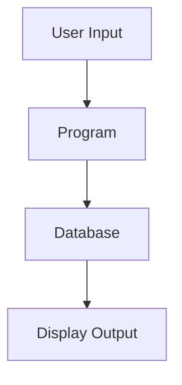

# {PROGRAM} - Analysis Report

**Analysis Date**: {DATE}
**Analyst**: AI Analysis Agent
**Complexity**: [LOW / MEDIUM / HIGH]

---

## 1. Program Purpose

[Clear description of what this program does from a business perspective]

## 2. Program Type

- [ ] Interactive (with display file)
- [ ] Batch Processing
- [ ] Report Generation
- [ ] Utility/Service Program
- [ ] API/Service

## 3. Input Parameters

| Parameter | Type | Description |
|-----------|------|-------------|
| | | |

## 4. Output Parameters

| Parameter | Type | Description |
|-----------|------|-------------|
| | | |

## 5. Files Used

### Physical Files (Database)
| File Name | Access Type | Key Fields | Purpose |
|-----------|-------------|------------|---------|
| | | | |

### Display Files
| File Name | Purpose | Records |
|-----------|---------|---------|
| | | |

### Printer Files
| File Name | Purpose |
|-----------|---------|
| | |

## 6. External Program Calls

| Program Called | Purpose | When Called |
|----------------|---------|-------------|
| | | |

## 7. Business Logic Flow

[Describe the main business logic flow in steps]

1.
2.
3.

## 8. Data Flow

## 9. Key Indicators Used

| Indicator | Purpose | Set When |
|-----------|---------|----------|
| *INLR | Last Record | Program termination |
| | | |

## 10. Special Considerations

### Date/Time Handling
-

### Numeric Precision
-

### Error Handling
-

### Performance Notes
-

## 11. Dependencies

### Called By
-

### Calls To
-

### Shared Resources
-

## 12. Conversion Complexity Assessment

**Overall Complexity**: [LOW / MEDIUM / HIGH]

**Complexity Factors**:
- Business Logic Complexity: [1-5]
- UI Complexity: [1-5]
- Database Interactions: [1-5]
- External Dependencies: [1-5]

**Risk Areas**:
-

## 13. Conversion Notes

[Any specific notes for the conversion agent about tricky parts or important considerations]

## 14. Test Scenarios to Cover

1.
2.
3.
