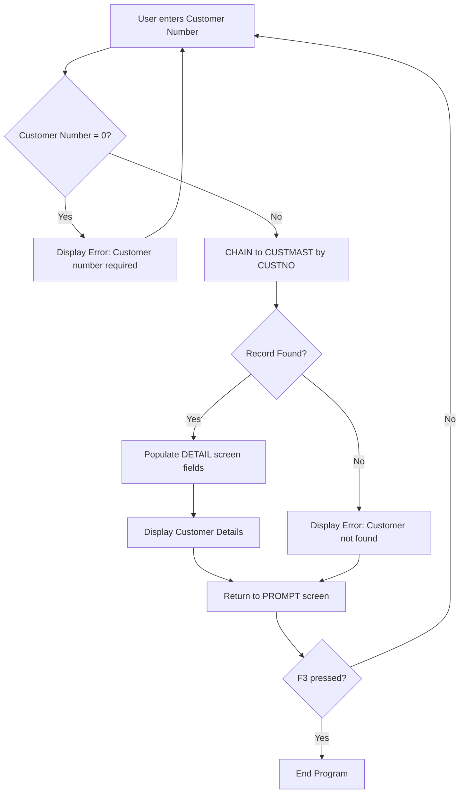

# CUST001 - Analysis Report

**Analysis Date**: 2025-12-28
**Analyst**: AI Analysis Agent
**Complexity**: LOW

---

## 1. Program Purpose

CUST001 is a customer inquiry program that allows users to look up and view customer information by entering a customer number. The program provides a simple interface for retrieving and displaying customer master data including contact information and account balance.

## 2. Program Type

- [x] Interactive (with display file)
- [ ] Batch Processing
- [ ] Report Generation
- [ ] Utility/Service Program
- [ ] API/Service

## 3. Input Parameters

| Parameter | Type | Description |
|-----------|------|-------------|
| None | - | Program accepts no external parameters |

## 4. Output Parameters

| Parameter | Type | Description |
|-----------|------|-------------|
| None | - | Program produces no output parameters |

## 5. Files Used

### Physical Files (Database)
| File Name | Access Type | Key Fields | Purpose |
|-----------|-------------|------------|---------|
| CUSTMAST | Input, Full Procedural, Externally Described, Keyed | CUSTNO (5P 0) | Customer master file containing customer information |

### Display Files
| File Name | Purpose | Records |
|-----------|---------|---------|
| CUSTDSP | Customer inquiry interface | PROMPT (customer number entry), DETAIL (customer information display) |

### Printer Files
| File Name | Purpose |
|-----------|---------|
| None | No printer files used |

## 6. External Program Calls

| Program Called | Purpose | When Called |
|----------------|---------|-------------|
| None | No external program calls | - |

## 7. Business Logic Flow

The program follows a simple inquiry pattern:

1. **Initialize**: Display the PROMPT screen to request customer number input
2. **Main Loop**: Continue processing until user presses F3 (Exit)
   - Clear error indicator (*IN90) and error message (PMSG)
   - Validate that customer number is not zero
   - If validation fails, set error indicator and display "Customer number required" message
   - If validation passes, attempt to read customer record using CHAIN operation
   - If customer found:
     - Populate all detail screen fields (DCUSTNO, DCUSTNAME, DADDR1, DCITY, DSTATE, DZIP, DPHONE, DBALANCE)
     - Display DETAIL screen showing customer information
   - If customer not found:
     - Set error indicator and display "Customer not found" message
   - Return to PROMPT screen for next inquiry
3. **Exit**: Set *INLR indicator and terminate program

## 8. Data Flow

## 9. Key Indicators Used

| Indicator | Purpose | Set When |
|-----------|---------|----------|
| *INLR | Last Record | Program termination (line 56) |
| *IN03 | F3=Exit | User presses F3 key to exit program |
| *IN90 | Error Indicator | Validation error occurs (customer number required or not found) |

## 10. Special Considerations

### Date/Time Handling
- Display file shows current time and date on screens (lines 19-20 in CUSTDSP)
- LASTORDER field in CUSTMAST (8P 0 format YYYYMMDD) is not used by this program
- Date display uses EDTCDE(Y) edit code for standard date formatting

### Numeric Precision
- Customer number: 5P 0 (5-digit packed decimal, no decimals) - supports customer numbers 1-99999
- Zip code: 5P 0 (5-digit packed decimal, no decimals) - standard US zip code format
- Balance: 9P 2 (9-digit packed decimal, 2 decimals) - supports balances up to $9,999,999.99
- Credit limit: 9P 2 (not used in this program)
- Balance display uses EDTCDE(J) for proper currency formatting

### Error Handling
- Simple validation: checks for customer number = 0
- Database error handling: uses %Found() built-in function to check CHAIN operation success
- User-friendly error messages displayed on PROMPT screen with color highlighting (RED)
- Error indicator (*IN90) controls visibility of error message field

### Performance Notes
- Single record access using keyed CHAIN operation (efficient)
- No file scanning or sequential processing
- Minimal memory footprint
- Screen-based interaction (synchronous processing)

## 11. Dependencies

### Called By
- Not specified - standalone interactive program, likely called from menu system

### Calls To
- None - no external program calls

### Shared Resources
- CUSTMAST physical file (shared with other customer maintenance programs)
- CUSTDSP display file (exclusive to this program)

## 12. Conversion Complexity Assessment

**Overall Complexity**: LOW

**Complexity Factors**:
- Business Logic Complexity: 1/5 (simple validation and lookup)
- UI Complexity: 1/5 (two simple screens with basic fields)
- Database Interactions: 1/5 (single table, keyed access only)
- External Dependencies: 1/5 (no external calls)

**Risk Areas**:
- None identified - straightforward conversion
- Standard CRUD pattern well-supported in Spring/JPA
- Display file maps cleanly to React form components

## 13. Conversion Notes

### For Database Agent (Phase 2):
- CUSTMAST will map to a JPA entity with CUSTNO as primary key
- Note that CREDITLIM and LASTORDER fields exist in the database but are not used by this program
- Consider whether to include unused fields in the entity (recommendation: include for completeness)

### For Conversion Agent (Phase 3):
- Main logic is a simple lookup service
- Service method signature: `CustomerDTO getCustomerByNumber(Integer customerNumber)`
- Validation: customer number must be > 0
- REST endpoint: GET `/api/customers/{customerNumber}`
- Return 404 Not Found if customer doesn't exist
- Return 400 Bad Request if customer number is invalid

### For UI Agent (Phase 4):
- PROMPT screen → React form with single input field (customer number) and submit button
- DETAIL screen → React component displaying customer information in a read-only format
- Preserve F3=Exit and F12=Return functionality as "Exit" and "Back" buttons
- Error messages should be displayed prominently (consider using Material-UI Alert or similar)
- Consider responsive design for mobile viewing

### For Testing Agent (Phase 5):
Key test scenarios:
- Valid customer number returns correct customer data
- Invalid customer number (0) returns validation error
- Non-existent customer number returns not found error
- Database connectivity error handling
- Edge cases: customer number at boundaries (1, 99999)

## 14. Test Scenarios to Cover

1. **Happy Path**: Enter valid customer number (e.g., 12345) → verify customer details displayed correctly
2. **Validation Error**: Enter customer number 0 → verify "Customer number required" error message
3. **Not Found**: Enter non-existent customer number (e.g., 99999) → verify "Customer not found" error message
4. **Boundary Values**: Test with customer number 1 (minimum) and 99999 (maximum)
5. **Data Display**: Verify all fields display correctly including proper formatting:
   - Currency format for balance (with 2 decimal places)
   - Zip code formatting (5 digits with leading zeros if needed)
   - Phone number formatting
6. **Navigation**: Verify F3/Exit button terminates session, F12/Back button returns to search
7. **Error Recovery**: After error, verify user can correct input and successfully retrieve customer
8. **Special Characters**: Test customer names with special characters, apostrophes, etc.
9. **Null/Empty Fields**: Test customers with missing phone, address fields
10. **Performance**: Verify lookup response time is acceptable (<1 second)
