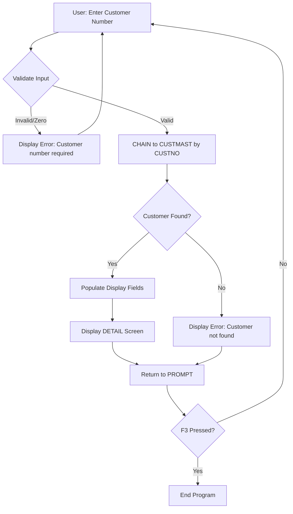

# CUST001 - Analysis Report

**Analysis Date**: 2025-12-17
**Analyst**: AI Analysis Agent
**Complexity**: LOW

---

## 1. Program Purpose

CUST001 is a customer inquiry program that allows users to look up and view customer information by entering a customer number. The program provides a simple interactive interface to search the customer master file and display detailed customer information including name, address, phone, and account balance.

## 2. Program Type

- [x] Interactive (with display file)
- [ ] Batch Processing
- [ ] Report Generation
- [ ] Utility/Service Program
- [ ] API/Service

## 3. Input Parameters

This is a standalone interactive program with no input parameters. User input is captured via display file.

| Parameter | Type | Description |
|-----------|------|-------------|
| None | - | Standalone interactive program |

## 4. Output Parameters

This is an interactive display program with no output parameters.

| Parameter | Type | Description |
|-----------|------|-------------|
| None | - | Interactive display only |

## 5. Files Used

### Physical Files (Database)
| File Name | Access Type | Key Fields | Purpose |
|-----------|-------------|------------|---------|
| CUSTMAST | Input (IF), Keyed | CUSTNO | Customer master file containing customer data |

### Display Files
| File Name | Purpose | Records |
|-----------|---------|---------|
| CUSTDSP | Customer inquiry UI | PROMPT (customer number entry), DETAIL (customer information display) |

### Printer Files
| File Name | Purpose |
|-----------|---------|
| None | No printer files used |

## 6. External Program Calls

| Program Called | Purpose | When Called |
|----------------|---------|-------------|
| None | No external program calls | N/A |

## 7. Business Logic Flow

The program follows a simple inquiry pattern:

1. **Initialize**: Display PROMPT screen to request customer number input
2. **Main Loop**: Continue processing until F3 (Exit) is pressed
   - Clear error indicator and message
   - Validate customer number (must be non-zero)
   - If validation fails, set error indicator and display error message
   - If valid, perform database lookup using CHAIN operation
   - If customer found:
     - Populate display fields with customer data
     - Display DETAIL screen showing customer information
   - If customer not found:
     - Set error indicator and display "Customer not found" message
   - Return to PROMPT screen for next inquiry
3. **Exit**: Set Last Record indicator and terminate program

## 8. Data Flow

## 9. Key Indicators Used

| Indicator | Purpose | Set When |
|-----------|---------|----------|
| *INLR | Last Record | Program termination (line 76) |
| *IN03 | Exit Key (F3) | User presses F3 to exit application |
| *IN90 | Error Display | Validation error or customer not found (lines 44, 68) |
| *IN12 | Cancel Key (F12) | User presses F12 to return (defined in DDS, not used in RPG) |

## 10. Special Considerations

### Date/Time Handling
- LASTORDER field in CUSTMAST uses packed decimal 8P 0 format (YYYYMMDD)
- Display file shows system DATE and TIME in header (edit code Y for date)
- Program does not manipulate dates directly

### Numeric Precision
- CUSTNO: 5P 0 (5-digit packed decimal, no decimals)
- ZIP: 5P 0 (5-digit packed decimal, no decimals)
- BALANCE: 9P 2 (9-digit packed decimal with 2 decimal places)
- CREDITLIM: 9P 2 (9-digit packed decimal with 2 decimal places)
- Edit codes used:
  - EDTCDE(Z): Zero suppression with no decimal
  - EDTCDE(J): Decimal editing with commas
  - EDTCDE(Y): Date editing (MM/DD/YY or locale-specific)

### Error Handling
- Basic validation: Ensures customer number is not zero
- Graceful handling of "not found" scenario with user-friendly message
- Error messages displayed in red with highlighting via indicator 90
- No exception handling for database errors or system failures

### Performance Notes
- Uses CHAIN operation for direct keyed access (optimal for single record lookup)
- No full file reads or cursor operations
- Minimal memory usage with simple data structures
- Interactive single-record processing (not designed for batch/high volume)

## 11. Dependencies

### Called By
- None identified (appears to be a standalone user-initiated program)
- Likely called from a menu system or command line

### Calls To
- None (no external program calls)

### Shared Resources
- CUSTMAST file (shared with other customer programs)
- Display file CUSTDSP (dedicated to this program)

## 12. Conversion Complexity Assessment

**Overall Complexity**: LOW

**Complexity Factors**:
- Business Logic Complexity: 1/5 (Simple inquiry with basic validation)
- UI Complexity: 1/5 (Two simple screens with standard layouts)
- Database Interactions: 1/5 (Single keyed read operation)
- External Dependencies: 1/5 (No external calls or complex dependencies)

**Risk Areas**:
- Packed decimal field handling must preserve precision during conversion
- Edit codes must be mapped to equivalent Java/UI formatting
- Function key handling (F3, F12) needs proper UI event mapping
- CHAIN operation %Found logic must be accurately converted

## 13. Conversion Notes

### For Database Agent:
- CUSTMAST should be converted to a JPA entity
- CUSTNO is the primary key (5-digit integer)
- All packed decimal fields need appropriate Java types (BigDecimal for monetary values)
- LASTORDER date field needs conversion from YYYYMMDD format to proper date type

### For Conversion Agent:
- Main logic can be converted to a simple controller method
- CHAIN + %Found pattern → JPA findById returning Optional
- DoW loop with F3 check → UI session management
- Data structure CUSTDS is defined but never used in the program (can be omitted)

### For UI Agent:
- Two screens to create: Customer search form and customer detail view
- Error messages should appear in a consistent location (preferably inline)
- Function keys: F3 (Exit/Close), F12 (Return/Back)
- Fields should use appropriate input masks (phone, zip) and formatting (currency)

### For Testing Agent:
- Test with valid customer numbers
- Test with invalid/non-existent customer numbers
- Test with zero/blank customer number
- Test boundary values for numeric fields
- Test function key behaviors (F3, F12)

## 14. Test Scenarios to Cover

1. **Happy Path**: Enter valid customer number → Display customer details → Return to prompt → Exit
2. **Customer Not Found**: Enter non-existent customer number → Display error message → Allow retry
3. **Validation Error**: Enter zero or leave blank → Display validation error → Allow correction
4. **Function Keys**:
   - Press F3 from PROMPT screen → Exit program
   - Press F3 from DETAIL screen → Exit program
   - Press F12 from DETAIL screen → Return to PROMPT screen
5. **Data Display**: Verify all fields display correctly with proper formatting (currency, phone, zip)
6. **Boundary Testing**: Test with maximum customer number (99999)
7. **Numeric Formatting**: Verify decimal places display correctly for balance field
8. **Multiple Inquiries**: Perform several consecutive lookups in same session
